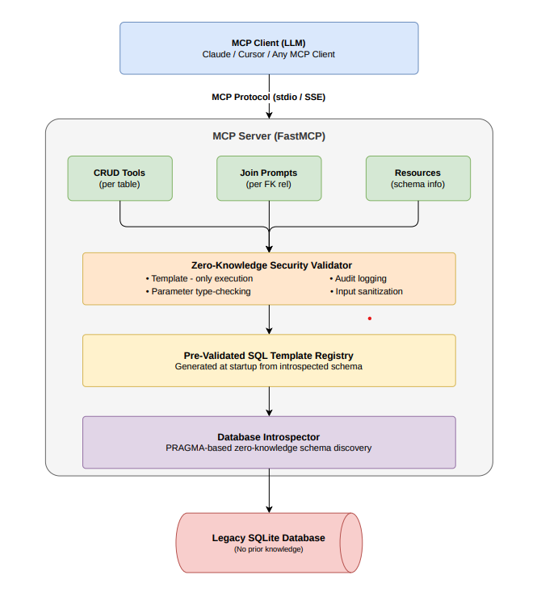

# Self-Documenting Zero-Knowledge MCP Server

A **Model Context Protocol (MCP)** server that autonomously scans an undocumented legacy database, generates CRUD tools for every table, creates prompts explaining how to join tables, and enforces **Zero-Knowledge security** by restricting the LLM to pre-validated SQL templates only.

## Architecture



## Features

- **Autonomous Schema Discovery** - Scans any SQLite database using PRAGMA introspection with zero prior knowledge
- **Dynamic CRUD Tools** - Auto-generates Create, Read, Update, Delete, List, and Search tools for every discovered table
- **Join Prompts** - Analyzes foreign key relationships and generates prompts explaining how to join tables
- **Zero-Knowledge Security** - All SQL execution is restricted to pre-validated parameterized templates
- **Audit Logging** - Every database operation is logged with timestamp, template ID, and parameters
- **Schema Resources** - MCP resources expose the discovered schema for LLM reference

## Quick Start

### Prerequisites

- Python 3.10+
- pip

### Installation

```bash
# Clone or unzip the project
cd "MCP SERVER"

# Install dependencies
pip install -r requirements.txt
```

### Seed the Demo Database

```bash
# Create a sample e-commerce legacy database
python server.py --seed
```

This creates `legacy_store.db` with 6 tables: `categories`, `customers`, `orders`, `order_items`, `products`, `reviews` — complete with foreign key relationships and sample data.

### Run the Server

```bash
# Run with stdio transport (default — for Claude Desktop)
python server.py

# Run with SSE transport (for network access)
python server.py --transport sse --port 8080

# Use a custom database
python server.py --db /path/to/your/database.db
```

### Connect with Claude Desktop

Add to your Claude Desktop config (`claude_desktop_config.json`):

```json
{
  "mcpServers": {
    "zk-database": {
      "command": "python",
      "args": ["C:/path/to/MCP SERVER/server.py", "--db", "C:/path/to/legacy_store.db"]
    }
  }
}
```

### Test with MCP Inspector

```bash
mcp dev server.py
```

## What Gets Generated

When the server starts, it introspects the database and auto-generates:

### Tools (per table)
| Tool | Description |
|:-----|:------------|
| `create_{table}` | Insert a new row with auto-generated parameter docs |
| `read_{table}` | Read a row by primary key |
| `update_{table}` | Update a row by primary key |
| `delete_{table}` | Delete a row by primary key |
| `list_{table}` | Paginated listing with limit/offset |
| `search_{table}` | Full-text search across text columns |

### Prompts
| Prompt | Description |
|:-------|:------------|
| `join_{table_a}_and_{table_b}` | Explains how to join two related tables |
| `explore_database` | Complete database exploration guide |
| `show_schema` | Full auto-discovered schema display |

### Resources
| Resource URI | Description |
|:-------------|:------------|
| `schema://tables` | Full schema overview |
| `schema://tables/{name}` | Per-table schema details |
| `security://audit-log` | Recent query audit log |
| `security://report` | Security summary report |
| `security://templates` | All registered SQL templates |

## Security Model

The **Zero-Knowledge** security model ensures the LLM never constructs or sees raw SQL:

1. **Template-Only Execution** — Only SQL from the pre-generated template registry can be executed. No raw SQL endpoint exists.
2. **Parameter Validation** — All parameters are type-checked against the introspected schema before execution.
3. **Input Sanitization** — Defense-in-depth blocklist catches SQL injection patterns in parameter values (even though parameterized queries already prevent injection).
4. **Audit Trail** — Every operation is logged with timestamp, template ID, parameters, success/failure status.
5. **No Schema Manipulation** — Only SELECT, INSERT, UPDATE, DELETE on existing tables. No DDL operations are possible.

## Running Tests

```bash
# Run all tests
python -m pytest tests/ -v

# Run specific test files
python -m pytest tests/test_security.py -v
python -m pytest tests/test_introspector.py -v
```

## Project Structure

```
MCP SERVER/
├── .gitignore                   # Git ignore rules
├── server.py                    # Main MCP server entry point
├── requirements.txt             # Python dependencies
├── pyproject.toml               # Project metadata
├── src/
│   ├── __init__.py
│   ├── introspector.py          # PRAGMA-based schema discovery
│   ├── schema_registry.py       # In-memory schema registry
│   ├── sql_templates.py         # Pre-validated SQL template engine
│   ├── security.py              # Zero-Knowledge security validator
│   ├── crud_generator.py        # Dynamic MCP tool generator
│   └── join_analyzer.py         # FK analysis & prompt generator
├── sample_data/
│   └── seed_legacy_db.py        # Demo legacy database seeder
├── tests/
│   ├── demo_client.py           # Standalone verification demo
│   ├── test_introspector.py     # Schema discovery tests
│   ├── test_crud.py             # CRUD operation tests
│   ├── test_security.py         # Security validation tests
│   └── test_joins.py            # Join analysis tests
└── docs/
    ├── APPROACH.md              # Technical approach documentation
    └── MCP_architecture.png     # Architecture diagram
```

## License

MIT
